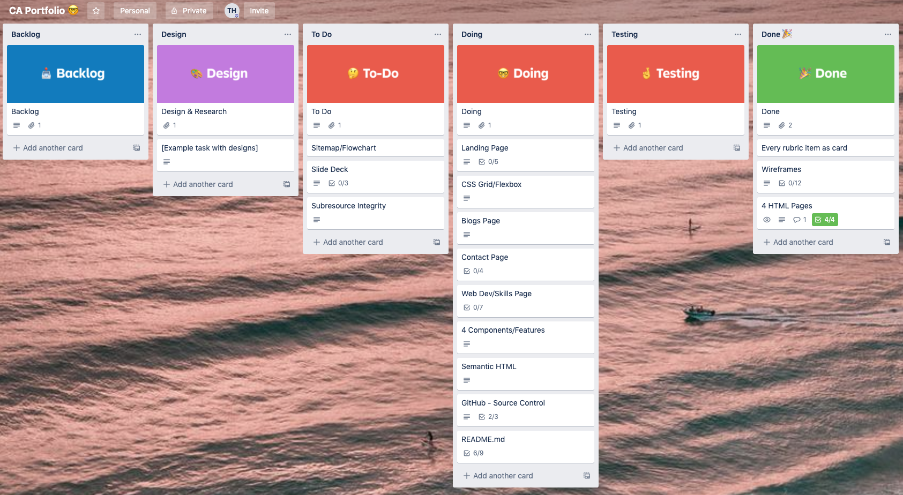

<!-- A link (URL) to your published portfolio website
A link to your GitHub repository (repo)
Ensure the repo is accessible by your Educators
Description of your portfolio website, including,
Purpose
Functionality / features
Sitemap
Screenshots
Target audience
Tech stack (e.g. html, css, deployment platform, etc) -->

# Tyler Hall's Portfolio

## CA T1A3

by Tyler Hall

---

My deployed website - [www.tyvisual.com](www.tyvisual.com "TY Visual Website")

Link to my GitHub repo - [https://github.com/Impicklerick12/portfolio](https://github.com/Impicklerick12/portfolio "Portfolio GitHub Repo")

---

## Purpose

The purpose of building this website was to showcase my web development progress and use all the newly acquired skills of HTML and CSS(SASS). In todays world, a professional online body of work is essential for all creative industries, not only does it showcase your work but it also provides a platform for interested guests to communicate with you. This portfolio was built to highlight the projects I have already undertaken, but also to act as a base for furture enhancements as my tech stack grows. In time I will be expanding on this, adding new pages, changing the styling, and incorporating new frameworks. I would love add new content which includes my commercial photography work which I have previously showcased in a portfolio online.
#

## Functionality/Features

The site was initially designed as a 4-page website, which includes a landing page, web development page, blogs page and contact page. Navigation through the pages is done using the page title icons on the header nav bar which is fixed to the top of the page. The nav bar is responsive to all devices, where the header links are styled into a hidden block list which can be accessed through the hamburger menu icon. The new navigation list is displayed full screen from the left using CSS animation and styling.
 
The website elements are styled mostly using CSS flex-box, as I found it an incredibly versatile method for organisation. Each flex-box has a max-width value which will adjust according to the media quieres, and may alter their flex-direction value depending on the device width. Smaller devices such as the phones and small tablets should view each element in a column, and larger devices such as the iPad Pro and desktop computers will display the content in rows, with flex-wrap active. Each element is sized individually in order to create an ‘easy on the eye’ experience for the user, without too many oversized or overlapping elements. 
 
My aim was to make a simple website that was functional and incorporated my alternate skills. A big part of this was the fixed header, where the hidden page links could be easily accessed from any page allowing for less user clicks.
 
The pages of my portfolio include:
 
* Landing Page

Designed as an eye-catching visual experience from the first time a guest enters the site. A full-screen photo is used as the body's background for the entire site, with all elements scrolling over the top. The landing page also combines the use of a scroll icon and smooth scrolling activated, which links to my about section. A link to my resume pdf is placed at the bottom of the landing page for any interested guests to access easily.

 * Web Development Page 

Showcases my current programming skills and projects undertaken at Coder Academy. This was designed to include two large flex-boxes containing information and links to each project, as well as a skills section at the bottom which highlights my current tech stack.
 
* Blogs Page

This was designed to display multiple elements on the one page, and was great practice in utilizing the flex-direction property to alter according to the media queries. Each blog contains a title, placeholder text, a date, and an image used from www.unsplash.com.
 
* Contact Page

Designed so that guests can choose how they would like to communicate with me, whether it be through my social media links, or the contact form (unfortunately not active at the moment though).
 
SASS was utilized as the CSS pre-processor to style each web page of the portfolio. Although it was slightly difficult to understand its purpose initially, I found it greatly beneficial once I got the hang of the nested syntax. Being able to nest tags and classes within other tags provided a clear understanding of which element was being styled specifically. The things I wish to learn more about SASS is the extended use of mixins and partials. In my portfolio I created a partial scss file to style each page of my site, which would be imported into the main.scss file, however my code is not as DRY as I would have liked as I had not fully appreciated the usefulness of mixins. 
#

## Wireframes 

### Landing Page

   
  
  

### Web-Dev Page

   
  
  

### Blogs Page

   
  
  

### Contact Page

   
  
  

#

## Sitemap

#

## Screenshots

### Trello Screenshots

### Mobile Screenshots

   
  
  

### Tablet Screenshots

   
  
  
  

### Desktop Screenshots

   
  
  
  

#

## Target Audience

This website was created to represent my web development body of work. It’s purpose is to display all relevant skills and projects undertaken, as well as giving the guest an insight into my personality and interests. My portfolio is targeted at potential employers, clients, peers and family, and any other professionals looking to assess my body of work. 
#

## Tech Stack

For this project, I utilised HTML5 and CSS to build and style my website. SASS was used as a CSS pre-processor, which was incredibly handy being able to reduce the written CSS. Flex-box was used to style and organise all elements on each page. The portfolio was deployed on Netlify.
#

© 2020 Tyler Hall